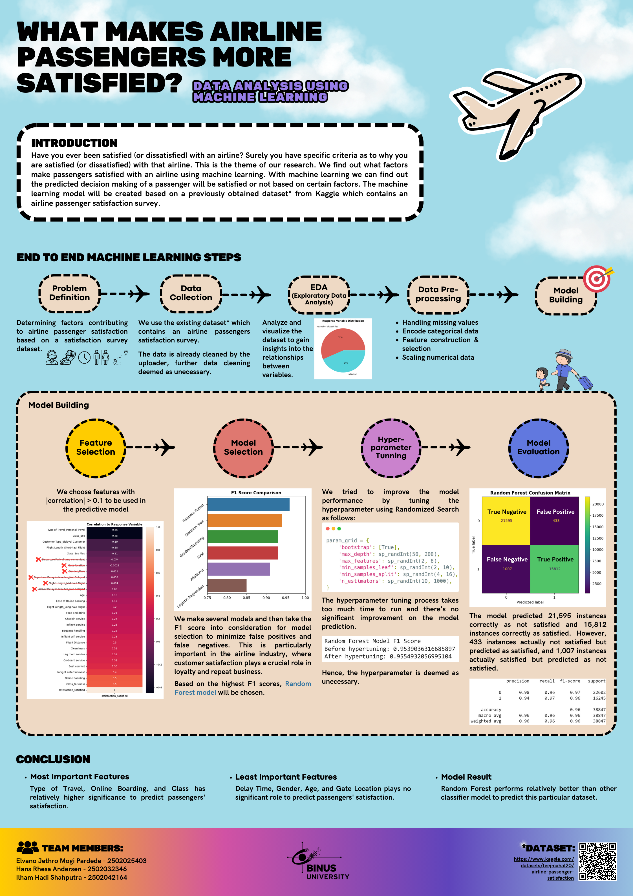

# Case Study: Flight Satisfaction ✈️

This project is a **data analysis case study** aimed at understanding the factors that influence **customer satisfaction** in the airline industry. By leveraging machine learning and data analytics techniques, the project explores key insights from airline customer feedback to identify the most important aspects contributing to passenger satisfaction or dissatisfaction.

## Introduction

Have you ever wondered what makes a passenger satisfied or dissatisfied with their flight experience? This project explores those very factors using machine learning techniques and a dataset from Kaggle containing airline passenger satisfaction survey results. The main goal is to uncover actionable insights for the airline industry that can help improve service quality and customer experiences.

Through **end-to-end machine learning** steps, we determine key drivers of satisfaction, such as **Type of Travel**, **Online Boarding**, and **Class**, while understanding which factors play a less significant role.

## Installation

To get started with this project, you'll need to have **Python 3.x** installed on your local machine. Follow these steps:

1. Clone the repository:
   ```bash
   git clone https://github.com/yourusername/flight-satisfaction-case-study.git
   cd flight-satisfaction-case-study
   ```

2. Install the required packages:
   ```bash
   pip install -r requirements.txt
   ```

3. Download the dataset (if not already included in the repo):
   - You can download the dataset from [Kaggle](https://www.kaggle.com/teejmahal20/airline-passenger-satisfaction).
   - Place the dataset files (`train.csv` and `test.csv`) in the root directory of the repository.

## Usage

After cloning the repository and installing the dependencies, you can run the Jupyter notebook for this project to reproduce the analysis:

1. Open the notebook:
   ```bash
   jupyter notebook ML_AOL_Flight_Satisfaction.ipynb
   ```

2. Follow along with the code and results, or modify the notebook to test out your own ideas.

3. The infographic summarizing the project findings is located in the root directory as `flight_infographics.png`.

## Project Results

- **Key Insights**:
  - The features with the highest impact on satisfaction are:
    - **Type of Travel**
    - **Online Boarding**
    - **Class**
  - Less important factors include **Delay Time**, **Gate Location**, and **Age**.
  
- **Model Performance**:
  - The Random Forest model achieved an **F1 Score** of `0.9559`, correctly predicting customer satisfaction with high precision.
  - Hyperparameter tuning did not significantly improve the model, so the default Random Forest model was deemed sufficient.

### Infographic

